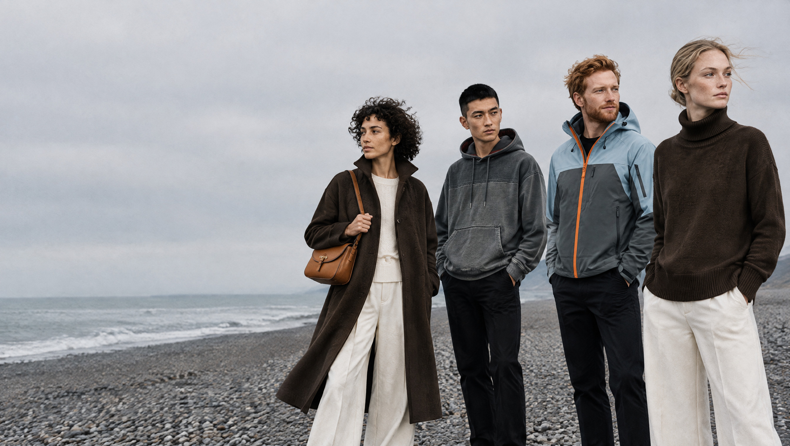
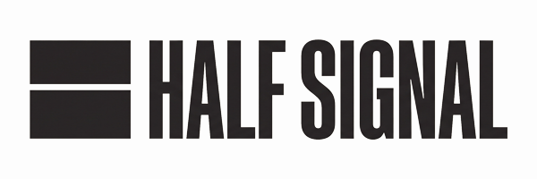
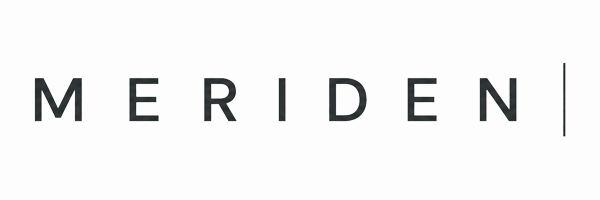
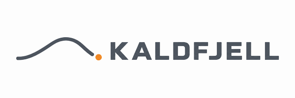
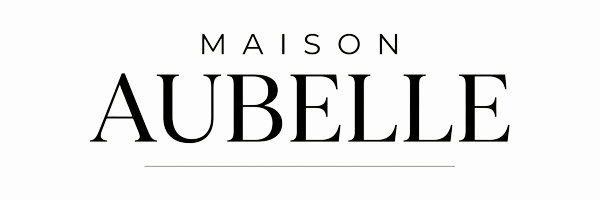
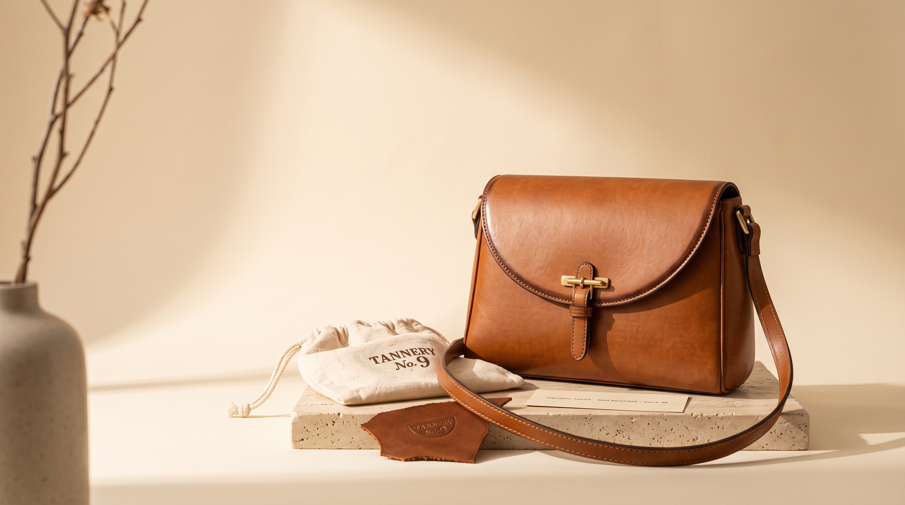
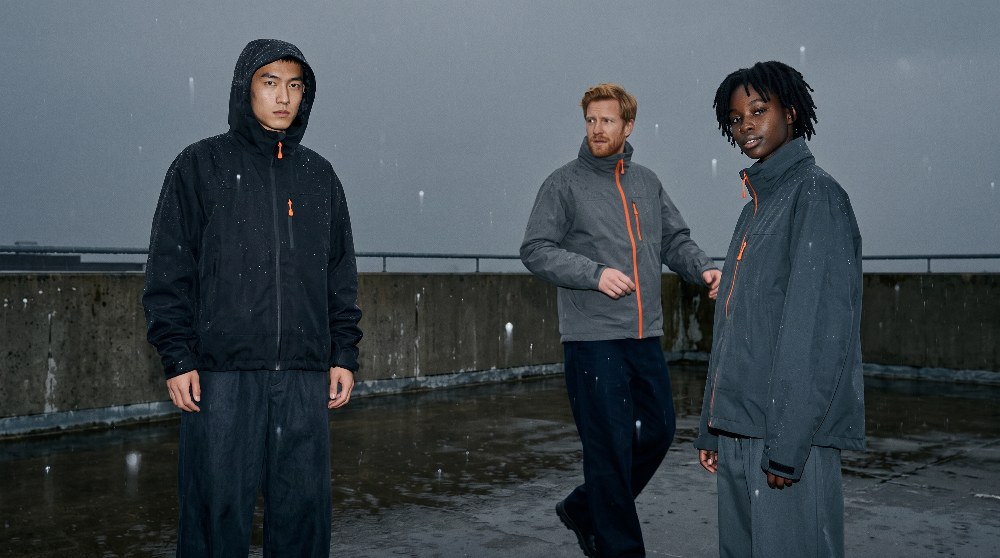
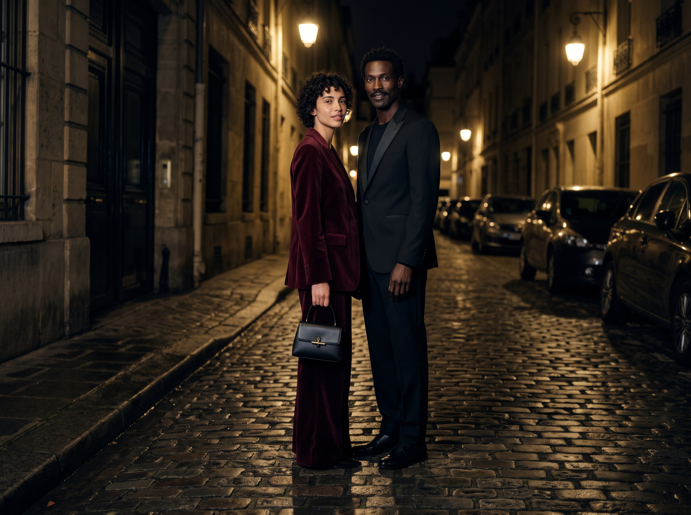

# FAST FORWARD Showroom

**A fictional fashion house you can load into any Salesforce B2C Commerce demo store.**



Five made-up labels, a recurring cast of synthetic models and products photographed consistently in every
colourway. No real brands, products or people. Every image was generated locally with openly licensed
(Apache 2.0) models, so the set is free to use commercially: in demos, pitches, products and training.

## Why use it

FAST FORWARD Showroom exists to show the FAST FORWARD storefront at its best.

**High-quality content.** Products are photographed on a consistent cast in every colourway, from the
front, side and back with a detail shot and a swatch, at the storefront's own tile ratio. Campaign imagery
sits beside it. The store reads as a real fashion retailer, not a demo with placeholder images.

**Brands and campaigns for content pages.** Five labels, each with a logo, a palette and its own voice,
plus seasonal campaigns. That is the material to build marketing content in Page Designer and show what
the storefront's content setup can do: the homepage ships as a Page Designer page built from its
components (campaign hero, category cards, label banner, product carousels, teasers).

**Products configured to trigger the storefront's flows.** Each product is set up to put the storefront
into a specific state, so every flow can be shown and tested on real data instead of mocks.

| Flow | Product | Since |
| --- | --- | --- |
| One size (no size selector) | Tannery No. 9 east-west bag | v0.2 |
| Promotion: sale price next to the list price | Half Signal hoodie | v0.2 |
| New-in badge | MERIDEN roll-neck jumper | v0.2 |
| Letter sizes versus numeric sizes | Kaldfjell shell (XS–XXL), Maison Aubelle coat (34–46) | v0.2 |
| Entry to premium price tiers | €99 hoodie to €1,200 coat | v0.2 |
| Low stock, sold-out size or colour, backorder, pre-order, scheduled prices, bundles, sets, options, variation groups, coming soon | a named product each | next |
| Order, shipping and coupon promotions, bonus products, "spend X more" messages | a promotion each | next |

Everything is fictional and generated with openly licensed models, so it is free to use commercially: in
demos, pitches and client sandboxes, with no rights questions.

## The labels

| Label | | What it is | Price range |
| --- | --- | --- | --- |
|  | **Half Signal** | Heavyweight streetwear and skate | €25–180 |
|  | **MERIDEN** | Scandinavian wardrobe essentials | €39–320 |
|  | **Kaldfjell** | Nordic technical outerwear | €29–450 |
|  | **Maison Aubelle** | Parisian tailoring | €180–1,200 |
|  | **Tannery No. 9** | Leather bags, shoes and small goods | €90–890 |

Each label's logo, transparent and on a white tile: [`brands/`](brands/).

## The campaigns

| | |
| --- | --- |
|  |  |
| **The No. 9 Bag**: the Tannery No. 9 drop | **Weather Report**: Half Signal × Kaldfjell |
|  |  |
| **Après Minuit**: Maison Aubelle with Tannery No. 9 | **Off duty**: the newsletter image |

All five campaign images are in [`campaigns/`](campaigns/). The homepage import uses the first four; the newsletter image is meant for the footer.

## Use it

Download the import archives from the [latest release](https://github.com/geebelendries/fastforward-showroom/releases/latest)
and import them into a sandbox, in this order:

| Archive | What it does |
| --- | --- |
| `ff-v0.2.zip` | The catalogue: products, variants, images, categories, EUR and GBP prices, stock |
| `site-switch.zip` | Points the `RefArchGlobal` site at the FAST FORWARD catalogue, prices and stock |
| `ff-home-v0.2.zip` | The homepage, as a Page Designer page in `RefArchSharedLibrary`, plus the label logos |
| `ff-v0.2-retire.zip` | Only when upgrading from v0.1: removes the colours v0.2 dropped |
| `site-rollback.zip` | Points the site back at the RefArch catalogue |

Import through **Business Manager → Administration → Site Development → Site Import & Export**, or with the
[B2C CLI](https://github.com/SalesforceCommerceCloud/b2c-developer-tooling):

```bash
b2c job import ff-v0.2.zip
```

Then rebuild the search index and clear the site page cache in Business Manager:

```bash
b2c job run sfcc-search-index-product-full-update -B '{"site_scope":["RefArchGlobal"]}' -w
```

An import merges, so running it again is safe. The homepage uses the Page Designer components of the FAST
FORWARD storefront, so that cartridge must be on the instance.

## Versions

### v0.2 (current, 2026-10-07)

The same five products, redesigned and re-shot, plus the content to put them in a finished store.

| | |
| --- | --- |
| **Products** | MERIDEN roll-neck jumper · Kaldfjell 3-layer shell · Half Signal heavyweight hoodie · Maison Aubelle double-face coat · Tannery No. 9 east-west bag |
| **Catalogue** | 5 masters, 81 colour × size variants, 17 categories in menu order, EUR and GBP list and sale prices, stock |
| **Design** | Each label has its own style (signature details, palette, what it never does) and the products follow the Fall/Winter 2026 and Spring/Summer 2027 trends |
| **Colourways** | 3 per product, 15 in all; five colours of v0.1 were replaced by stronger ones |
| **Photography** | New product photos, 20 on-model views, 41 recolours and 15 swatches, at the storefront's tile ratio (325 : 462) so tiles show the whole frame |
| **Cast** | 8 people, a woman and a man per apparel label, plus the faceless Tannery No. 9 styling line, with the same face in every view |
| **Brands** | A logo per label |
| **Campaigns** | Five campaign images: the AW26 hero, the No. 9 Bag, Weather Report, Après Minuit and the newsletter |
| **Homepage** | A Page Designer homepage: campaign hero, category cards, label banner, new-in carousel and campaign teasers |

### v0.1 (2026-10-05)

The pilot: one product per label.

| | |
| --- | --- |
| **Products** | The same five product types, first designs |
| **Catalogue** | 5 masters, 81 variants, 18 categories, EUR and GBP prices, one flat stock level |
| **Photography** | 5 product photos, 20 on-model views, 40 recolours and 15 swatches, at 2 : 3 (tiles crop them slightly) |
| **Cast** | 4 people and the Tannery No. 9 styling line |

### Next

- **The full catalogue:** about 90 products across the five labels.
- **Developer scenarios:** a named product for every state the storefront must handle (low stock, sold out,
  pre-order, sale and scheduled prices, bundles, sets, options, variation groups, coming soon), with resettable stock.
- **Promotions:** the flows the SFRA demo data covers, rebuilt on Showroom products: order and shipping
  discounts with and without a coupon, "spend X more" messages, bonus products and a choice of bonus,
  discounts on qualifying products only, promotions that do not stack, and one for a customer group.
- **Localisation:** copy beyond English.
